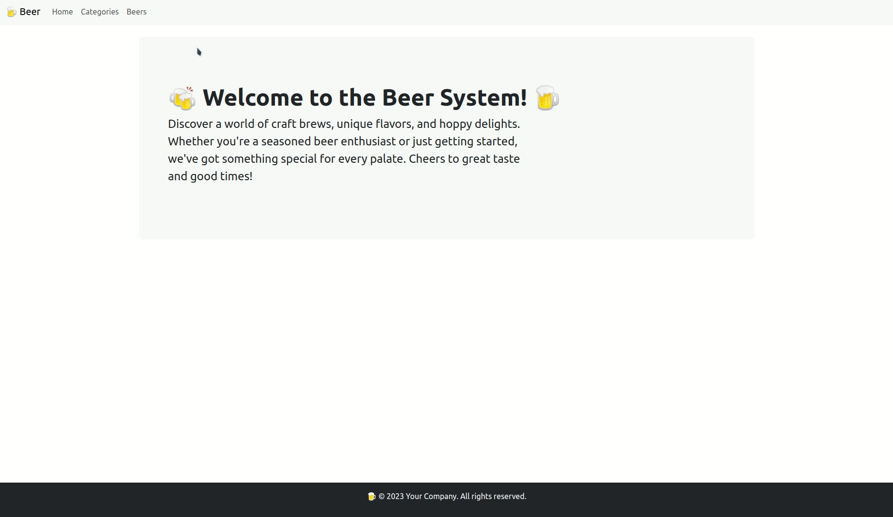
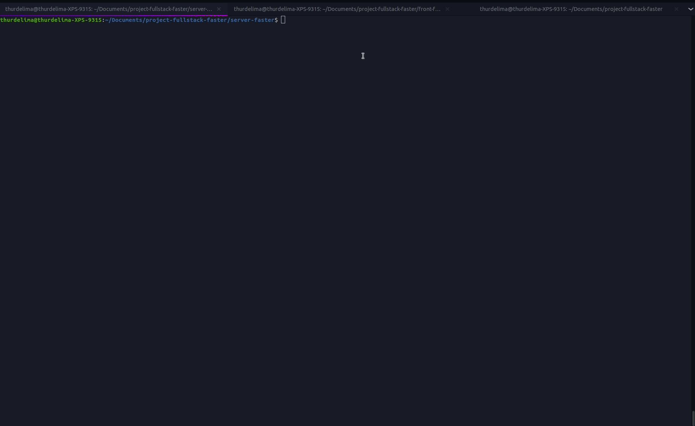
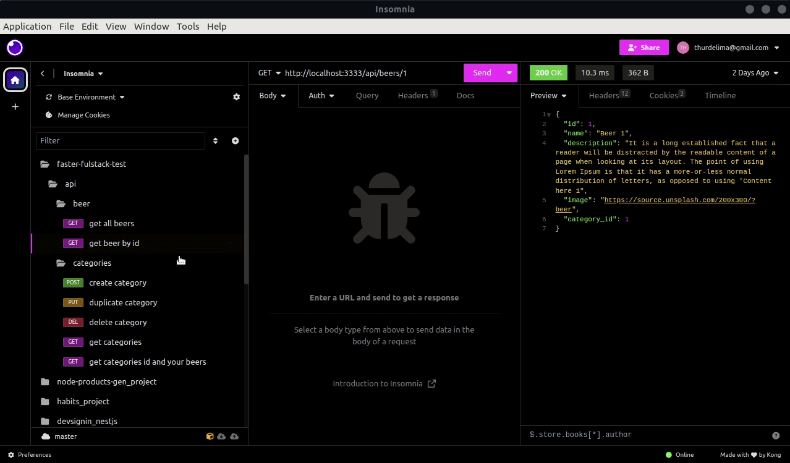

# 🍺 Node-nuxt-beers

Node and nuxt project based faster test.

## 🪧 Demonstration:

<div align="center" >
  
</div>

## 🧰 Backend:

Configure connection postgress in .env.example (.env) file.

Run migrations.

```bash
  adonis seed --files database/seeds/CategorySeeder.js
  adonis seed --files database/seeds/BeerSeeder.js
```

And run project.

```bash
  npm run start
```

## 🧪 Tests:

To run tests, just type npm run test.

```bash
  npm run test
```

<div align="center" >
  
</div>

## 🧳 Collections

Just import file collections-faster_collections.json in your insomnia or postman to make requests.

<div align="center" >
  
</div>


## 💅 Frontend

Run project.

```bash
  npm run dev
```

## 🦮 Adaptability and responsivess

Adjust responsive by responsively app.

<div align="center" >
  
</div>

<br/>

<h4 align="center">

Made with ♥ by Arthur Lima :wave: [Get in touch!](https://www.linkedin.com/in/arthur-lima-294ab0103/)

</h4>